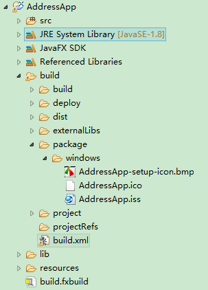

Actually you can't change this using ANT. However, as you already know the deploy mechanism uses Inno Setup and you can modify its behaviour.  

During the fx:deploy ANT task a default ApplicationName.iss file is created. This default file contains e.g. the setting, which is responsible for the install directory. This default file is only created, if you don't provide any customized on your own. So, I would recommend to run the ANT script, copy the default file and modify it. If you enable the verbose flag of the fx:deploy task you can use the console output to find out, where the default file is created and where the ANT task searches for your customized file before creating the default one:  
```XML
<fx:deploy
    ...
    verbose="true">

    <fx:info title="${appname}" vendor="${vendor}"/>
    ...
</fx:deploy>
```
In my case I found the default file in

C:\Users\gfkri\AppData\Local\Temp\fxbundler3627681647438085792\windows
and had to put the customized file to

package/windows/ApplicationName.iss
relative to the ANT build script.

* If you got so far, you'll find the line DisableDirPage=Yes in your ApplicationName.iss file. Change it to DisableDirPage=No and the user gets the possibility to change the install directory.

* Further you will find the parameter DefaultDirName. If you want to install your Application to C:\Program File\ApplicationName by default you can use the constant {pf} e.g.: DefaultDirName={pf}\ApplicationName.

**PS**：
* Default setting: UsePreviousAppDir,so you needed to uninstall first, and then it will use your new location.  
* 软件安装时如果出现错误，请注销计算机，然后尝试再次安装。  
* iss文件的例子

例子中的文件名为AddressApp.iss，文件位置：`build\package\windows\AddressApp.iss`。



```XML
;This file will be executed next to the application bundle image
;I.e. current directory will contain folder AddressApp with application files
[Setup]
AppId={{fxApplication}}
AppName=AddressApp
AppVersion=1.0
AppVerName=AddressApp 1.0
AppPublisher=makery.ch
AppComments=AddressApp
AppCopyright=Copyright (C) 2016
;AppPublisherURL=http://java.com/
;AppSupportURL=http://java.com/
;AppUpdatesURL=http://java.com/
DefaultDirName={pf}\AddressApp
DisableStartupPrompt=Yes
DisableDirPage=No
DisableProgramGroupPage=Yes
DisableReadyPage=No
DisableFinishedPage=No
DisableWelcomePage=No
DefaultGroupName=makery.ch
;Optional License
LicenseFile=
;WinXP or above
MinVersion=0,5.1 
OutputBaseFilename=AddressApp-1.0
Compression=lzma
SolidCompression=yes
PrivilegesRequired=lowest
SetupIconFile=AddressApp\AddressApp.ico
UninstallDisplayIcon={app}\AddressApp.ico
UninstallDisplayName=AddressApp
WizardImageStretch=No
WizardSmallImageFile=AddressApp-setup-icon.bmp   
ArchitecturesInstallIn64BitMode=x64


[Languages]
Name: "english"; MessagesFile: "compiler:Default.isl"

[Files]
Source: "AddressApp\AddressApp.exe"; DestDir: "{app}"; Flags: ignoreversion
Source: "AddressApp\*"; DestDir: "{app}"; Flags: ignoreversion recursesubdirs createallsubdirs

[Icons]
Name: "{group}\AddressApp"; Filename: "{app}\AddressApp.exe"; IconFilename: "{app}\AddressApp.ico"; Check: returnTrue()
Name: "{commondesktop}\AddressApp"; Filename: "{app}\AddressApp.exe";  IconFilename: "{app}\AddressApp.ico"; Check: returnFalse()


[Run]
Filename: "{app}\AddressApp.exe"; Parameters: "-Xappcds:generatecache"; Check: returnFalse()
Filename: "{app}\AddressApp.exe"; Description: "{cm:LaunchProgram,AddressApp}"; Flags: nowait postinstall skipifsilent; Check: returnTrue()
Filename: "{app}\AddressApp.exe"; Parameters: "-install -svcName ""AddressApp"" -svcDesc ""AddressApp"" -mainExe ""AddressApp.exe""  "; Check: returnFalse()

[UninstallRun]
Filename: "{app}\AddressApp.exe "; Parameters: "-uninstall -svcName AddressApp -stopOnUninstall"; Check: returnFalse()

[Code]
function returnTrue(): Boolean;
begin
  Result := True;
end;

function returnFalse(): Boolean;
begin
  Result := False;
end;

function InitializeSetup(): Boolean;
begin
// Possible future improvements:
//   if version less or same => just launch app
//   if upgrade => check if same app is running and wait for it to exit
//   Add pack200/unpack200 support? 
  Result := True;
end;  
```


