## Flowcharts - Basic Syntax used in Haroopad
### 1.简单示例
代码：
	```mermaid
	graph TD
	  A-->B
	  A-->D
	  B-->C
	  D-->C
	```

效果：
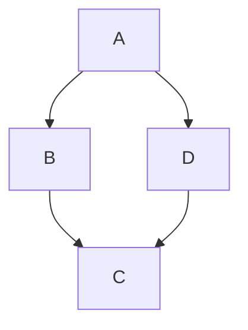
### 2.布局
`graph TD`declares a graph oriented from top to bottom.
##### 示例：
代码：
	```mermaid
	graph TD;
	Start-->Stop
	```

效果：
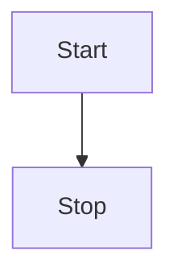
`graph LR`declares a graph oriented from left to right.
##### 示例
代码：
	```mermaid
	graph LR
	id1[This is the text in the box]
	id2((This is the text in the circle))
	id3(A node with round edges)
	id4>This is the text in the box]
	id2{This is the text in the box}

	%% A link with arrow head
	A-->B
	%% An open link
	C---D
	%% Text on links
	U-- This is the text -->V
	X-->| This is the text |Y;
	E-- This is the text ---F
	G---| This is the text |H;
	%% Dotted link
	I-.->J;
	%% Dotted link with text
	K-. text .->L
	%% Thick link
	M==>N
	%% Thick link with text
	O== text ==>P
	```

效果：
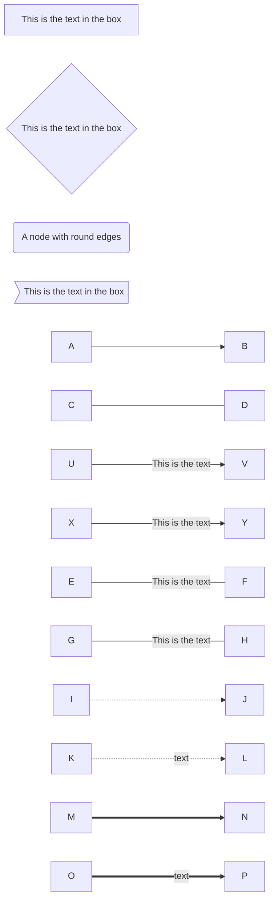
**Possible directions are:**
* TB - top bottom
* BT - bottom top
* RL - right left
* LR - left right
* TD - same as TB

### 3.Subgraphs
```Bash
subgraph title
    graph definition
end
```
代码:
	```mermaid
	 %% Subgraph example
	 graph TB

			 subgraph one
			 a1-->a2
			 end
			 subgraph two
			 b1-->b2
			 end
			 subgraph three
			 c1-->c2
			 end
			 c1-->a2
	```
效果：
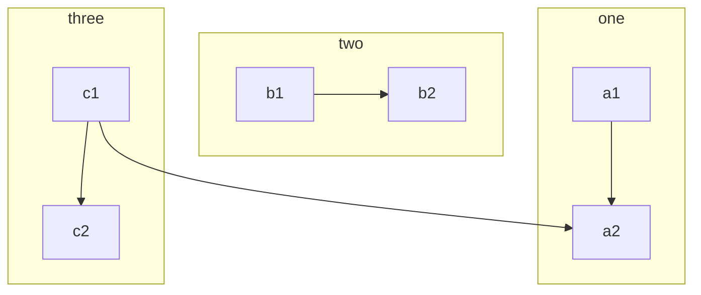
### 4.Styling links
代码：
	```mermaid
	graph LR
	A-->B
	B-->C
	A-->C
	C-->D
	linkStyle 0 stroke:#ff3,stroke-width:4px;
	linkStyle 1 stroke:#ff3,stroke-width:4px;
	linkStyle 3 stroke:#ff3,stroke-width:4px;
	```
效果：
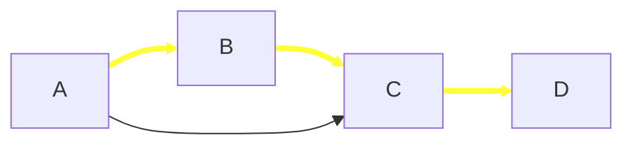
### 5.Styling a node
代码：
	```mermaid
	%% Example code
	graph LR
		id1(Start)-->id2(Stop)
		style id1 fill:#f9f,stroke:#333,stroke-width:4px;
		style id2 fill:#ccf,stroke:#f66,stroke-width:2px,stroke-dasharray: 5, 5;
	```
效果：
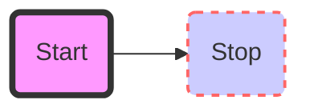
### 6.Class
代码：
	```mermaid
	graph TB
	id1(Start)-->id2(End)
	classDef className fill:#f9f,stroke:#333,stroke-width:4px;
	classDef myClass fill:#ccf,stroke:#f66,stroke-width:2px,stroke-dasharray: 5, 5;
	class id1,id2 className
	%% class id2 myClass
	```
效果：
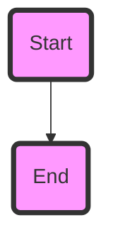
### 7.Default class
If a class is named default it will be assigned to all classes without specific class definitions.
代码：
	```mermaid
	graph LR
	Start---End
	id1(A)-.->id2(B)
	classDef default fill:#f9f,stroke:#333,stroke-width:4px;
	```
效果：
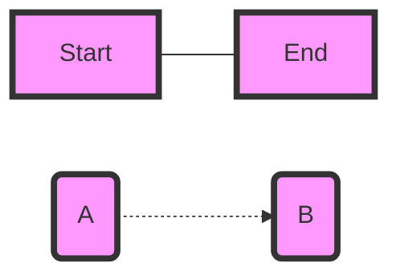

### 8.Entity codes to escape characters
代码：
	```mermaid
	  graph LR
			A["A double quote:#quot;"] -->B["A dec char:#9829;"]
	```
效果：
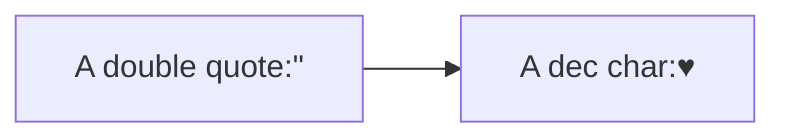
### 9.Interaction
代码：

	graph LR;
		A-->B;
		click A callback "Tooltip"
		click B "http://www.github.com" "This is a link"
效果：
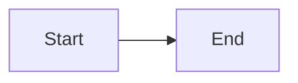
### 10.完整示例
###### 1)简单：
代码：
	```mermaid
	graph LR
	A[Hard edge] -->|Link text| B(Round edge)
		B --> C{Decision}
		C -->|One| D[Result one]
		C -->|Two| E[Result two]
	```
效果：
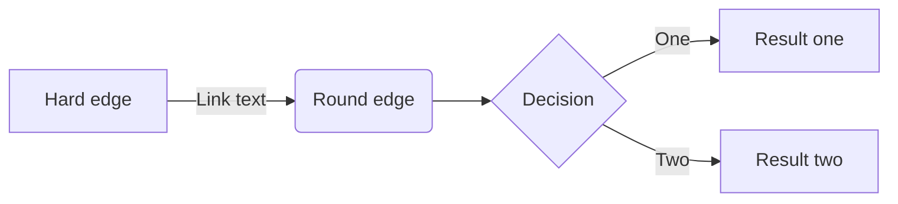
###### 2）复杂:
代码：

	```mermaid
	graph TB
		sq[Square shape] --> ci((Circle shape))

		subgraph A subgraph
			od>Odd shape]--  Two line <br> edge comment --> ro
			di{Diamond with <br/> line break} -.-> ro(Rounded<br>square<br>shape)
			di==>ro2(Rounded square shape)
		end

		%% Notice that no text in shape are added here instead that is appended further down
		e --> od3>Really long text with linebreak<br>in an Odd shape]

		%% Comments after double percent signs
		e((Inner / circle<br>and some odd <br>special characters)) --> f(,.?!+-*ز)

		cyr[Cyrillic]-->cyr2((Circle shape Начало));

		classDef green fill:#9f6,stroke:#333,stroke-width:2px;
		classDef orange fill:#f96,stroke:#333,stroke-width:4px;
		class sq,cyr green
		class di orange
	```
效果：
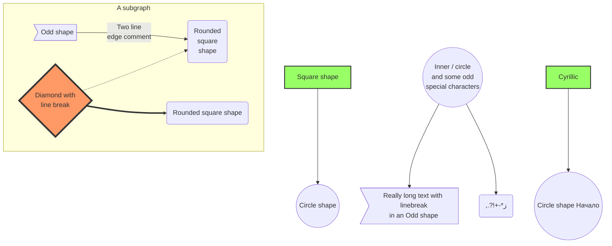
