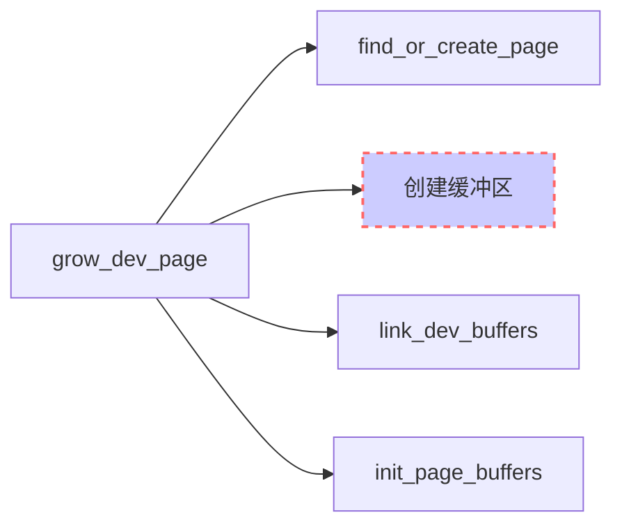

## 第16章 页缓存和块缓存
***
### 独立的缓冲区--LRU块缓存
##### 1.操作方式
* 为什么采用LRU？  
LRU代表最近最少使用（least recently used），指的是一种一般方法，可用于有效管理一个集合中最常使用的那些成员。如果经常访问一个数据元素，则该元素很可能位于物理内存中（因而被缓存）。较不常用或很少使用的数据元素，将随时间的推移，逐渐自动退出缓存。
* 实现基本原理：  
上一次使用的数据元素，将由内核自动放置到LRU列表的第一个位置上。如果缓存中已经有数据元素，则只改变各个元素的位置。如果该数据元素是从块设备读取的，则将数组的最后一个元素退出缓存，从内存中释放。

##### 2.实现
>数据结构

实现的起点是bh_lru结构，其定义如下：

```C++
fs/buffer.c
#define BH_LRU_SIZE	8

struct bh_lru {
	struct buffer_head *bhs[BH_LRU_SIZE];
};
static DEFINE_PER_CPU(struct bh_lru, bh_lrus) = {{ NULL }};
```
##### 3.实现--两个公开的函数（通过内核提供）
bhs是一个缓冲头指针的数组，用作实现LRU算法的基础（按定义所示，其中包括8个数据项）。内核使用DEFINE\_PER\_CPU，为系统的每个CPU都建立一个实例，改进对CPU高速缓存的利用率。
* lookup_bh_lru检查所需数据项是否在缓存中：

```C++
/*
 * Look up the bh in this cpu's LRU.  If it's there, move it to the head.
 */
static struct buffer_head *
lookup_bh_lru(struct block_device *bdev, sector_t block, unsigned size)
{
	struct buffer_head *ret = NULL;
	struct bh_lru *lru;
	unsigned int i;

	check_irqs_on();//如果定义了关中断，则关闭中断
	bh_lru_lock();//加锁，实质是关闭本地中断
	lru = &__get_cpu_var(bh_lrus);//根据当前CPU选择对应的数组
	for (i = 0; i < BH_LRU_SIZE; i++) {
		struct buffer_head *bh = lru->bhs[i];
		//条件成立即表示所需数据在缓存中
		if (bh && bh->b_bdev == bdev &&
				bh->b_blocknr == block && bh->b_size == size) {
			if (i) {//i为0，则不需要做任何操作
				while (i) {
				//将i前的所有数组元素都往右一个下标
					lru->bhs[i] = lru->bhs[i - 1];
					i--;
				}
				//将数组的首元素置为所查找的数据项
				lru->bhs[0] = bh;
			}
			get_bh(bh);
			ret = bh;
			break;
		}
	}
	bh_lru_unlock();
	return ret;
}
```
* bh_lru_install将新的缓冲头添加到缓存中：

```C++
/*
 * The LRU management algorithm is dopey-but-simple.  Sorry.
 */
static void bh_lru_install(struct buffer_head *bh)
{
	struct buffer_head *evictee = NULL;
	struct bh_lru *lru;

	check_irqs_on();
	bh_lru_lock();
	lru = &__get_cpu_var(bh_lrus);
	if (lru->bhs[0] != bh) {//查找新的数据项是否一致lru列表的首项中，不在则继续
		struct buffer_head *bhs[BH_LRU_SIZE];//新定义一个与lru列表相同的数组，作为临时数组，作拷贝之用
		int in;
		int out = 0;

		get_bh(bh);//将bh的引用计数器加1，原子操作
		bhs[out++] = bh;//将临时数组的首元素置为新的缓冲头,out此时值为1
		for (in = 0; in < BH_LRU_SIZE; in++) {
		//获得lru列表中的每一个元素
			struct buffer_head *bh2 = lru->bhs[in];
		//如果lru列表中有一项与新的缓冲头相同，则释放该项（其实是将其引用计数器减1），并重新循环
			if (bh2 == bh) {
				__brelse(bh2);
			} else {
				if (out >= BH_LRU_SIZE) {//此处为true说明lru已经满了，故而应该删除列表的最后一项（根据LRU原则，将lru列表的最后一项赋给eviotee，后面会被释放）
					BUG_ON(evictee != NULL);
					evictee = bh2;
				} else {
				//将lru列表中的元素拷贝到临时数组中
					bhs[out++] = bh2;//out总比in大1
				}
			}
		}
		while (out < BH_LRU_SIZE)
			bhs[out++] = NULL;//将临时数组的最后一个有用项之后一项赋为null，为memcpy做准备。
		memcpy(lru->bhs, bhs, sizeof(bhs));
	}
	bh_lru_unlock();
	//释放原lru列表的最后一项
	if (evictee)
		__brelse(evictee);
}
```
##### 4.接口函数
**注意**：如果lookup\_bh\_lru失败，不会自动从块设备读取所需的块。而是通过下列接口函数完成：  
普通的内核代码通常不会接触到bh\_lookup\_lru或bh\_lru\_install，因为二者被封装起来。内核提供了通用例程来访问各个块，它们自动涵盖了块缓存，使得没必要与块缓存进行显式交互。这些例程包括\_\_getblk和\_\_bread。

###### 两个函数的相同点：
* 函数原型相同：  
可以这样描述：
```C++
typedf struct buffer_head (get_read)(struct block_device *bdev, sector_t block, unsigned size)；
get_read* __getblk;
get_read* __bread;
```
数据块可通过所在块设备的block\_device实例、扇区编号（sector\_t类型）和块长度唯一标识。

###### 两个函数的不同点(不同点与两个函数的目标有关)：
* \_\_bread保证返回一个包含最新数据的缓冲区。这导致在必要的情况下，需要读取底层块设备。
* 调用\_\_getblk总是返回一个非NULL指针（即一个缓冲头）。如果所要缓冲区的数据已经在内存中，则返回数据，但不保证数据的状态。与\_\_bread相比，数据可能不是最新的。而另一种可能性是，缓冲区对应的块尚未读入内存。在这种情况下，_\_getblk确保分配数据所需的内存空间，并将缓冲头插入到LRU缓存。

##### 5.\_\_getblk函数
因为\_\_bread会调用\_\_getblk，所以我们先看一下\_\_getblk的代码流程图：
  
在执行\_\_getblk时有两条执行路径：  

1)调用\_\_find\_get\_block使用如下所述的方法来查找所要的缓冲区。如果查找成功则返回一个buffer_head实例。否则，任务委托给\_\_getblk\_slow。  

2)\_\_getblk\_slow能产生所要的缓冲区，但用时比\_\_find_get_block长。但该函数能够保证总是可以返回一个适当的buffer\_head实例并为数据分配内存空间。  

最后，\_\_getblk函数使用bh_lru_install将其将缓冲头插入到块缓存，而touch_buffer对与缓冲区相关的页调用了mark_page_accessed方法（参见第18章）。  
代码如下:
```C++
struct buffer_head *
__getblk(struct block_device *bdev, sector_t block, unsigned size)
{
	struct buffer_head *bh = __find_get_block(bdev, block, size);

	might_sleep();
	if (bh == NULL)//__find_get_block发挥null，则进入__getblk_slow，该函数保证至少会分配缓冲头和实际数据所需的内存空间。
		bh = __getblk_slow(bdev, block, size);
	return bh;
}

EXPORT_SYMBOL(__getblk);
```

```C++
struct buffer_head *
__find_get_block(struct block_device *bdev, sector_t block, unsigned size)
{
    //调用lookup_bh_lru函数，检查所需的块是否已经在LRU缓存中
	struct buffer_head *bh = lookup_bh_lru(bdev, block, size);

	if (bh == NULL) {
	//__find_get_block_slow函数试图在页缓存中查找该数据
		bh = __find_get_block_slow(bdev, block);
    /*__find_get_block_slow试图在页缓存中查找该数据，这可以产生两个不同的结果:
	1)如果数据不在页缓存中，或虽然在页缓存中，但对应的页没有与之关联的缓冲区，则返回一个NULL指针;
	2)如果数据在页缓存中，且对应页有相关的缓冲区，则返回指向所要缓冲头的指针。
	*/
		if (bh)//如果根据上述函数找到了缓冲头，则调用bh_lru_install函数将其添加到缓存。
			bh_lru_install(bh);
	}
	if (bh)//所需块已经在LRU缓存中
		//touch_buffer会调用mark_page_accessed将该页标记为与缓存关联之后，内核返回到__getblk。
		touch_buffer(bh);
	return bh;
}
```
```C++
static struct buffer_head *
__getblk_slow(struct block_device *bdev, sector_t block, int size)
{
	//...
	for (;;) {//无限循环,内核试图反复在内存中创建数据结构，直至成功
		struct buffer_head * bh;
		int ret;
		//再次调用__find_get_block函数，但是刚才明明已经调用失败，为何这样做？
		/*
		原因：只有在与此同时有另一个CPU建立了所需的缓冲区，并在内存中创建了对
		应的数据结构时，这一次函数调用才会成功。尽管这不太可能，但仍然必须检查。
		*/
		bh = __find_get_block(bdev, block, size);
		if (bh)
			return bh;//如果这次调用成功(找到缓冲头)，则返回。
		//不成功，内核则调用grow_buffers，试图为缓冲头和实际数据分配内存，
		//并将该内存空间添加到内核的数据结构。
		ret = grow_buffers(bdev, block, size);
		//调用grow_buffers会返回三种结果：
		/*
		（1）如果成功（ret>0），则再次调用__find_get_block，这一次会返回
		所要所要的buffer_head。
		（2）如果对grow_buffers的调用返回负值，这意味着块超出了页缓存索引
		的范围，此时将放弃循环，因为目标块在物理上是不存在的。
		（3）如果grow_buffers返回0，这意味着内存不足，无法增加缓冲区，
		接下来调用free_more_memory试图释放更多的物理内存来改善这种状况
		*/
		if (ret < 0)
			return NULL;
		if (ret == 0)
			free_more_memory();
	}
}
```
grow_buffers在进行一些正确性检查之后，它将工作委托给grow_dev_page函数，grow_dev_page函数的代码流程图如下：

<!--

-->
  

**解释:**  
1)find_or_create_page查找一个适当的页或创建一个新页，来保存数据。内存不足则返回NULL指针。  

2)如果页已经与长度正确的缓冲区相关联，通过init_page_buffers来修改剩余的缓冲区数据（b_bdev和b_blocknr），那么grow_dev_page就无事可做，可以退出。  

3）否则，使用alloc_page_buffers生成一组新的缓冲区，使用link_dev_buffers函数关联到页。而init_page_buffers用来填充缓冲头的状态（b_status）和管理数据（b_bdev、b_blocknr）。

##### 6.\_\_bread函数
与\_\_getblk函数不同，\_\_bread确保返回一个数据最新的缓冲区。其实现代码如下：
```C++
struct buffer_head *
__bread(struct block_device *bdev, sector_t block, unsigned size)
{
//调用__getblk，确认缓冲头和实际数据所需的内存空间都已经就位。
	struct buffer_head *bh = __getblk(bdev, block, size);

	if (likely(bh) && !buffer_uptodate(bh))//缓冲的数据不是最新的
	//__bread_slow向块层提交一个请求，在物理上读取数据，并等待操作完成。
	//接下来，在缓冲区的数据保证为最新之后，返回缓冲头指针。
		bh = __bread_slow(bh);
	return bh;//如果缓冲的数据已经是最新的，则返回指向缓冲头的指针。
}
```

##### 7.在文件系统中的使用
内核中需要用到按块读取的方式的场景不多，但是用到处都很重要。特别是，文件系统在读取超级块或管理块时利用了上述的两个例程。
内核定义了两个函数，以简化文件系统处理单个块的工作：
```C++
<buffer_head.h>
sb_bread(struct super_block *sb, sector_t block)
{
	return __bread(sb->s_bdev, block, sb->s_blocksize);
}

static inline struct buffer_head *
sb_getblk(struct super_block *sb, sector_t block)
{
	return __getblk(sb->s_bdev, block, sb->s_blocksize);
}
```
从代码中可以看出，用于读取特定文件系统的例程使用了一个超级块、一个块号和一个块长度作为参数。


